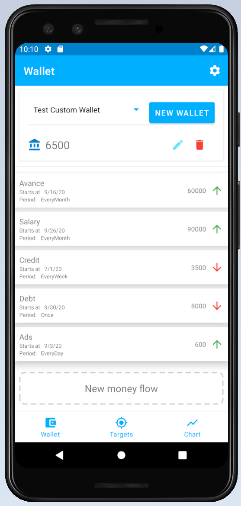

# FinTrackerSampleApp
Sample finfancial targets and money flows repo using Room, LiveData, Coroutines, ViewModel, Hilt

App contains multiple activites, fragments and dialogs, data stored locally via Room

User can add/remove targets/goals and money flows, app calculates timing of goals achievement and draws balance chart

Contains RU localization

Currently I am refactoring and writing tests

Screenshots:
Wallets | Goals | Chart
 |  | 
